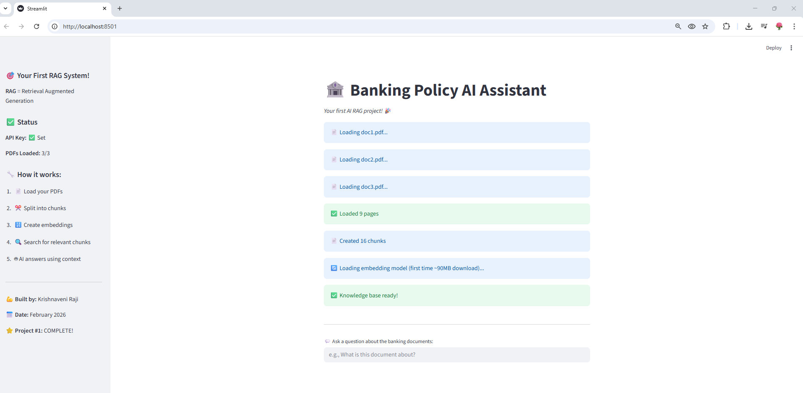
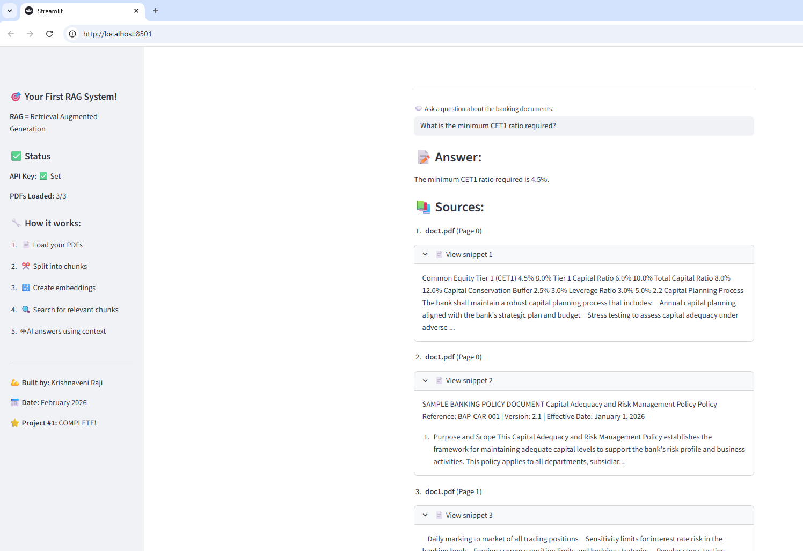

# 🏦 Banking Policy AI Assistant

An intelligent RAG (Retrieval Augmented Generation) system that answers 
questions about banking policies using AI.

**Built as my first AI project - February 2026** 🚀


## 🎯 What It Does

- 📄 Upload banking policy documents (PDFs)
- 💬 Ask questions in natural language
- 🤖 Get AI-powered answers instantly
- 📚 View source citations from documents
- 🔍 Semantic search (finds meaning, not just keywords!)

## 📸 Screenshots

### App Interface


### AI Answer with Sources


## 🏗️ How It Works (RAG Architecture)
```
PDF Documents
     ↓
Text Extraction (PyPDF)
     ↓
Chunking (1000 chars, 200 overlap)
     ↓
Embeddings (HuggingFace - FREE & Local!)
     ↓
Vector Database (ChromaDB)
     ↓
User Question → Search → Top 3 Relevant Chunks
                                    ↓
                         Google Gemini 2.5 Flash
                                    ↓
                         Answer + Source Citations
```

## 🛠️ Technologies Used

| Technology | Purpose | Cost |
|------------|---------|------|
| Python 3.10 | Programming language | Free |
| Streamlit | Web interface | Free |
| Google Gemini 2.5 Flash | AI language model | Free tier |
| HuggingFace Embeddings | Text embeddings | Free & Local |
| ChromaDB | Vector database | Free |
| LangChain | RAG framework | Free |
| PyPDF | PDF processing | Free |

**Total cost: $0** 🎉

## 🚀 How to Run

### Prerequisites
- Python 3.10+
- Google Gemini API key (free at [aistudio.google.com](https://aistudio.google.com))

### Installation
```bash
# Clone repository
git clone https://github.com/krishnaveniraji/banking-policy-ai-assistant
cd banking-policy-ai-assistant

# Create virtual environment
python -m venv .venv

# Activate (Windows)
.venv\Scripts\activate

# Install dependencies
pip install -r requirements.txt
```

### Setup

1. Create `.env` file:
```
GOOGLE_API_KEY=your-api-key-here
```

2. Add PDF documents to project folder:
```
doc1.pdf  ← Your first banking policy PDF
doc2.pdf  ← Your second banking policy PDF
doc3.pdf  ← Your third banking policy PDF
```

3. Run the app:
```bash
streamlit run simple_rag_working.py
```

4. Browser opens at `http://localhost:8501`

## 💡 Key Concepts Learned

### What is RAG?
**Retrieval Augmented Generation** = AI that answers from YOUR documents

**Why RAG over plain ChatGPT?**
| Plain LLM | RAG System |
|-----------|------------|
| May hallucinate | Grounded in real documents |
| No source citations | Shows exact sources |
| Generic knowledge only | Works with private/specific data |
| Can't use recent docs | Uses your latest documents |

### What are Embeddings?
Text converted to numbers (vectors) that capture **meaning**.
Similar meaning = similar numbers = easy to search semantically!

### What is a Vector Database?
Stores embeddings for fast **semantic search**.
"Find me chunks similar to this question" = instant results!

## 🧪 Sample Questions to Test

**Capital Adequacy (doc1.pdf):**
- "What is the minimum CET1 ratio required?"
- "What are the types of risks managed?"
- "How often is capital adequacy reported?"

**KYC & AML (doc2.pdf):**
- "What documents are required for expatriate customers?"
- "When is Enhanced Due Diligence required?"
- "What is the cash transaction reporting threshold?"

**Lending Policy (doc3.pdf):**
- "What is the maximum personal loan for expatriates?"
- "What is the maximum LTV for home loans?"
- "How many days before a loan is classified as Loss?"

## 🎓 My Learning Journey

**Background:** 15+ years Microsoft Power Platform specialist

**Challenge on Day 1:**
- Zero AI projects
- Self-doubt: "I'm not confident enough"
- Wanted to study 3 platforms before building

**What I did instead:**
- Started building immediately
- Debugged 10+ import errors
- Pushed through every obstacle

**Result after 1 day:**
- Working RAG system! 💪
- Proved I can build AI applications
- Ready for Project 2!

**Key lesson:**
> "Start before you feel ready. Build while you learn. 
> Confidence comes from DOING, not from studying more."

## 🗺️ Project Roadmap

- [x] Project 1: Banking Policy RAG Assistant ✅
- [ ] Project 2: Invoice Processing AI Agent
- [ ] Project 3: Treasury Multi-Agent System
- [ ] Project 4: SharePoint AI Search
- [ ] Certification: Microsoft AI-102 (March 2026)
- [ ] Certification: Microsoft AB-100 Agentic AI (July 2026)

## 👩‍💻 About Me

**Krishnaveni Raji**
Microsoft Power Platform & AI Specialist | 15+ Years

- 🏦 Banking domain expertise (Emirates Islamic Bank)
- ⚡ Power Platform (Power Apps, Power Automate, Power BI)
- 🤖 Agentic AI Specialist (2026)
- 📍 Dubai, UAE
- 🎓 Microsoft Certified: DP-600, DP-700, PL-300, PL-900

[](https://linkedin.com/in/krishoj)
[](https://github.com/krishnaveniraji)

## 📅 Built

**February 16, 2026** - Day 1 of my AI journey! 🚀

## 📄 License

MIT License - feel free to learn from this!

---
⭐ If this helped you, please give it a star!
```
